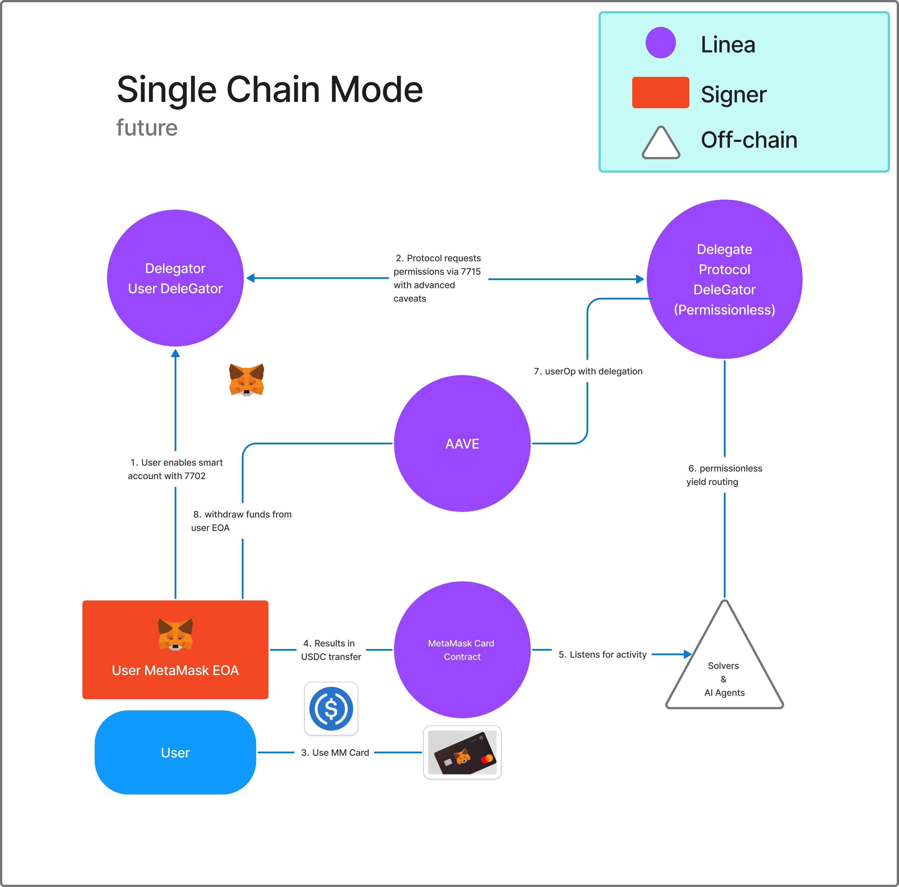

# 🪙 Auto HODL

**Auto HODL** is Acorns.com for your MetaMask Card. Aut HODL enables users to **automatically save** USDC while spending using their **MetaMask card**. It works by **rounding up** each transaction to the nearest dollar and sending the spare change to a **savings account** — effortlessly building a crypto savings habit.

Some of the features include: 

- Round up payments to the nearest USDC dollar and send the change to AAVE.
- MetaMask DTK/DeleGators for protecting users funds. The protocol can only send up to your round-up amount.
- Realtime multi-chain Aave yield optimization.
- Cross chain with LiFi/CCTP v2.
- Circle Modular Wallets for custody.

---

## 🏗️ Hackathon Demo Modes

During the [MetaMask Card hackathon](https://www.hackquest.io/hackathons/MetaMask-Card-Dev-Cook-Off) we shipped two working prototypes and sketched a third, future-ready design:

### 1. Single-chain (hackathon)


End-to-end flow on Sepolia. Every MetaMask Card purchase is rounded-up and the difference is supplied to the Aave pool on the same chain.

### 2. Multi-chain (hackathon)


At round-up time the backend finds the best Aave yield, bridges funds via **LiFi/CCTP**, and supplies on the destination chain.

### 3. Single-chain (future)



Planned production upgrade:

* Use Linea. Cannot be used now becuase DTK/DeleGator not yet compatible with Linea.
* Use **native smart accounts** instead of explicit DTK deployment.
* Request delegated permissions with **ERC-7715**.
* Use the underlying EOA (connected to the card) as the savings source.
* Use Circle Gateway for instananeous bridging.
* Batching funds before bridging or depositing into Aave, to reduce the impact of fees.

---
## Progress During Hackathon

All code was written during this hackathon. But the [original concept](https://devfolio.co/projects/auto-hodl-e5dd) was first explored during ETH Denver 2024. Back then, Auto HODL was a brute proxy contract that required all transactions be executed through a custom UI.

With significant new features from MetaMask, Circle, and LiFi, a much more user friendly UX is now possible.

Here is a rundown of some of the most important implementation details:
- Triggered by [deposits to MM Card](https://github.com/locker-labs/auto-hodl/blob/93467ae7d29651b0fab2296aba98281558dd1b2f/apps/web/src/lib/constants.ts#L5) contract.
- [Delegations](https://github.com/locker-labs/auto-hodl/blob/93467ae7d29651b0fab2296aba98281558dd1b2f/apps/web/src/hooks/useMetaMaskDTK.tsx#L174) to give protocol access to user funds.
- [Caveats](https://github.com/locker-labs/auto-hodl/blob/93467ae7d29651b0fab2296aba98281558dd1b2f/apps/web/src/lib/utils.ts#L12) to ensure only USDC is spent, and only up to the round-up amount.
- [Creation](https://github.com/locker-labs/auto-hodl/blob/93467ae7d29651b0fab2296aba98281558dd1b2f/apps/web/src/lib/circle/createSmartAccount.ts) of Circle Modular Wallets for cross-chain savings.
- [LiFi/CCTP v2](https://github.com/locker-labs/auto-hodl/blob/93467ae7d29651b0fab2296aba98281558dd1b2f/apps/web/src/lib/lifi/index.ts) integration.
- Aave [yield optimization](https://github.com/locker-labs/auto-hodl/blob/93467ae7d29651b0fab2296aba98281558dd1b2f/packages/scripts/find-optimal-yield.ts).
- Sample [trigger address](https://arbiscan.io/address/0xF445b07Aad98De9cc2794593B68ecD4aa5f81076)
- Sample [source of funds](https://arbiscan.io/address/0xc8f20aa6Ac3650241a88f0e4300ca988EfDc241F) (delegator)
- [Protocol delegate](https://arbiscan.io/address/0x4D769e03B8D068147B6aF4935F8fE419Cfd03784)

### Limitations
- Using Arbitrum as the home chain, because Linea is [not currently compatible](https://t.me/c/1883939594/983/3573) with DTK/DeleGator.
- We deactivated more advanced caveats that were working to limit interaction to [Aave](https://github.com/locker-labs/auto-hodl/blob/93467ae7d29651b0fab2296aba98281558dd1b2f/apps/web/src/lib/yield/caveats.ts) and [LiFi](https://github.com/locker-labs/auto-hodl/blob/93467ae7d29651b0fab2296aba98281558dd1b2f/apps/web/src/lib/lifi/caveats.ts)/CCTP. This is because it would have required creating multiple sets of delegations, and a more complex UX.
- Always bridging 1 USDC, regardless of round-up amount. LiFi does not reliably return routes for smaller amounts.
- The single chain flow does truly deposit funds into Aave for yield. But the multi chain flow only parks savings in a Circle wallet. Additional UX would be needed for the extra step of moving from Circle wallet to Aave.

---

## 🚀 Features

* 💳 **MetaMask Card Integration** – track on-chain card transactions.
* 💰 **Round-up Savings** – every purchase rounds up to the nearest dollar and saves the difference.
* 🔐 **Non-custodial** – savings are stored on-chain using smart accounts.
* 🧾 **Dashboard** – view savings history and growth.
* 🌐 **Cross-chain** – find the best yield across multiple chains.

---

## 🛠️ Tech Stack

### Core Technologies
* **USDC** – all savings denominated in USDC
* **MetaMask SDK** – wallet connection and user authentication
* **MetaMask DTK** – smart accounts and delegated permissions
* **Aave** – yield generation on deposited savings
* **Circle CCTP v2** – cross-chain USDC transfers
* **LiFi** – cross-chain bridging infrastructure

### Development Stack
| Layer     | Tech                                  |
| --------- | ------------------------------------- |
| Frontend  | Next.js, Tailwind CSS, Wagmi          |
| Backend   | Next.js, Supabase, Webhooks          |
| Contracts | Solidity, Foundry                     |
| Infra     | Vercel, Supabase, Moralis             |
| Monorepo  | Turborepo, bun                        |

---

## 📦 Monorepo Structure

This project is organized as a **monorepo** to cleanly separate concerns across services and packages:

```
./
│
├── apps/
│   └── web/           # Frontend + Backend (Next.js)
│
├── packages/
│   ├── contracts/     # Smart contracts (Solidity, Foundry)
│   └── scripts/       # Automation scripts (Moralis, etc.)
│
├── .github/           # GitHub workflows (CI/CD)
├── docs/              # Documentation and diagrams
├── package.json       # Monorepo root configuration
└── README.md
```

---

## 🧑‍💻 Getting Started

### 1. Clone the Repository

```bash
git clone https://github.com/locker-labs/auto-hodl.git
cd auto-hodl
```

### 2. Install Dependencies

```bash
bun install
```

### 3. Environment Variables

Create `.env` files in `apps/web` and `packages/contracts` as needed.

### 4. Dev Scripts

Run all apps in dev mode:

```bash
bun run dev
```

Build all packages and apps:

```bash
bun run build
```

Or build individually:

```bash
bun run build:contracts
bun run build:web
```

Clean all packages and apps:

```bash
bun run clean
```

---

## 🔐 Smart Contracts

The `contracts` package contains the core logic for savings:

* `SavingsVault.sol` – receives and tracks round-up deposits.
* `Registry.sol` – links users to vaults.
* Written in **Solidity**, tested using **Foundry**.

### Deploy

```bash
cd packages/contracts
forge script script/Deploy.s.sol --rpc-url $RPC_URL --broadcast
```

---

## 📈 Future Improvements

* **Native Smart Accounts** – use built-in MetaMask smart accounts instead of explicit DTK deployment
* **ERC-7715 Permissions** – request delegated permissions directly from smart accounts
* **EOA as Savings Source** – use the underlying EOA (connected to MetaMask Card) as the token source
* **Recurring Savings & Goals** – automated deposits and savings targets
* **ZK Privacy** – private savings history and transaction details

---

## 🙌 Contributing

PRs and issues are welcome! Before contributing, please:

```bash
bun run lint
bun run test
```

---

## 📄 License

MIT © 2025 [Locker Labs](https://github.com/locker-labs)